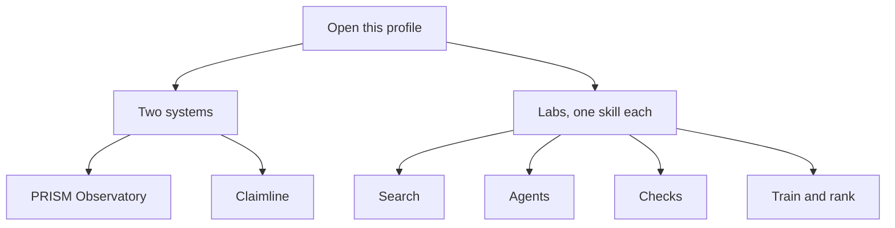

# Samesun Singh

Data Science & Engineering at Politecnico di Torino.

This page is a map of the account. The repositories are the work. A portfolio site with the same projects is at [sam9875.github.io](https://sam9875.github.io).

## What is happening here

Two systems sit in front. The labs behind them each practice one piece.

A question about a stack of notes goes to **PRISM**. A job post goes to **Claimline**. Claimline may cite only public repositories on this account. A skill with no card stays a gap.

## Open these two first

### [PRISM Observatory](https://github.com/Sam9875/prism-observatory)

A retrieval desk. The notes are indexed once. A question hits a guard, then one of three paths:

- **Glass** searches once.
- **Crystal** expands the names once, then stops.
- **Aurora** can search again, at most twice.

The answer is copied from the notes. A cited sentence has to appear in the passage it cites. Open `dashboard/index.html` and choose **Flow** to follow one question.

### [Claimline](https://github.com/Sam9875/claimline)

A brief that can cite only work you can point at. It screens the job text, keeps cards that already list the skill, and writes each sentence from a template. A request for years of experience is never marked covered. Open `dashboard/index.html`. **How it moves** is the path. **This brief** is one sample result.

## The labs, by job

<strong>Search</strong> — find a passage before anyone writes an answer

| Repository | What it does |
| --- | --- |
| [rag-from-scratch-lab](https://github.com/Sam9875/rag-from-scratch-lab) | Chunk, embed, retrieve, generate. Aimed at sparse news queries. |
| [qdrant-semantic-search](https://github.com/Sam9875/qdrant-semantic-search) | Semantic and hybrid search over news and supplier records. |
| [hackathon2026](https://github.com/Sam9875/hackathon2026) | Supplier search by semantic matching. |

PRISM is the desk that puts this kind of search behind guards and three paths.

<strong>Agents</strong> — plan, use a tool, then stop

| Repository | What it does |
| --- | --- |
| [langgraph-agent-lab](https://github.com/Sam9875/langgraph-agent-lab) | Planner, retrieval, a policy check, then a draft. News research. |
| [openhands-coding-agent](https://github.com/Sam9875/openhands-coding-agent) | Plan, patch, run tests, stop on an oracle. |
| [mcp-server-lab](https://github.com/Sam9875/mcp-server-lab) | A Model Context Protocol server: news search, listing fit, breakdown risk. |
| [hackathon-Cyber-security-](https://github.com/Sam9875/hackathon-Cyber-security-) | Prompt injection and multi-agent behavior for chatbots. |

<strong>Checks</strong> — keep a claim tied to evidence

| Repository | What it does |
| --- | --- |
| [Tenant-bias-LLM](https://github.com/Sam9875/Tenant-bias-LLM) | Audit of language models used as rental-screening assistants, on Turin listings. |
| [promptfoo-evals-lab](https://github.com/Sam9875/promptfoo-evals-lab) | Evaluation cases with fairness assertions from that audit. |
| [LLM-for-software-engineering](https://github.com/Sam9875/LLM-for-software-engineering) | A write-up of the same tenant-bias audit. The README title is the audit, not a software-engineering product. |

Claimline is the system that turns this habit into a job brief.

<strong>Train and rank</strong> — fit a model, then see where it is weak

| Repository | What it does |
| --- | --- |
| [unsloth-lora-lab](https://github.com/Sam9875/unsloth-lora-lab) | LoRA fine-tune recipe for news titles and abstracts, aimed at one GPU. |
| [made-with-ml-ops](https://github.com/Sam9875/made-with-ml-ops) | A path from a notebook to a trained, evaluated, registered model. |
| [microsoft-recommenders-lab](https://github.com/Sam9875/microsoft-recommenders-lab) | Two-tower model and cold-start slices on MIND-style news. |
| [MIND-large-column](https://github.com/Sam9875/MIND-large-column) | Training the MIND large set with a two-tower model. |
| [Two-Tower-thesis](https://github.com/Sam9875/Two-Tower-thesis) | Public notes sitting next to that two-tower work. |

<strong>Also public</strong>

| Repository | What it does |
| --- | --- |
| [gemini-multimodal-lab](https://github.com/Sam9875/gemini-multimodal-lab) | Text, image, and short-video questions, Ego4D-flavoured. |
| [Egocentric_VIsion](https://github.com/Sam9875/Egocentric_VIsion) | Egocentric video with VSLNet and VSLBase. |
| [DNLP-BESSTIE-Extensions](https://github.com/Sam9875/DNLP-BESSTIE-Extensions) | Sentiment and sarcasm across varieties of English. |
| [Column-Demo-apk](https://github.com/Sam9875/Column-Demo-apk) | Demo builds for Column News. |
| [Sam9875.github.io](https://github.com/Sam9875/Sam9875.github.io) | The portfolio site. Live at [sam9875.github.io](https://sam9875.github.io). |

## How to read a repository here

1. Read the first screen of its README.
2. If it contains `dashboard/index.html`, open that file. PRISM uses **Flow**. Claimline opens on **How it moves**.
3. A lab is a public practice piece. PRISM and Claimline say in their READMEs what they record and what they leave out.

Older coursework and small experiments stay on the account. Start with the two systems above.
